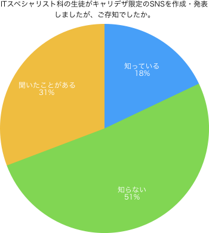
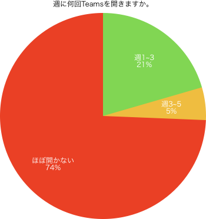
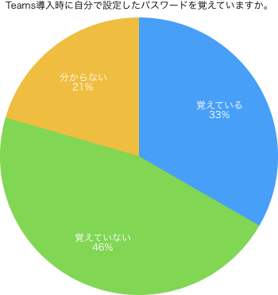
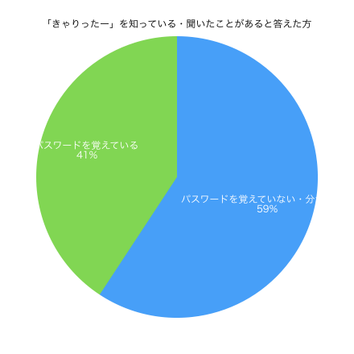
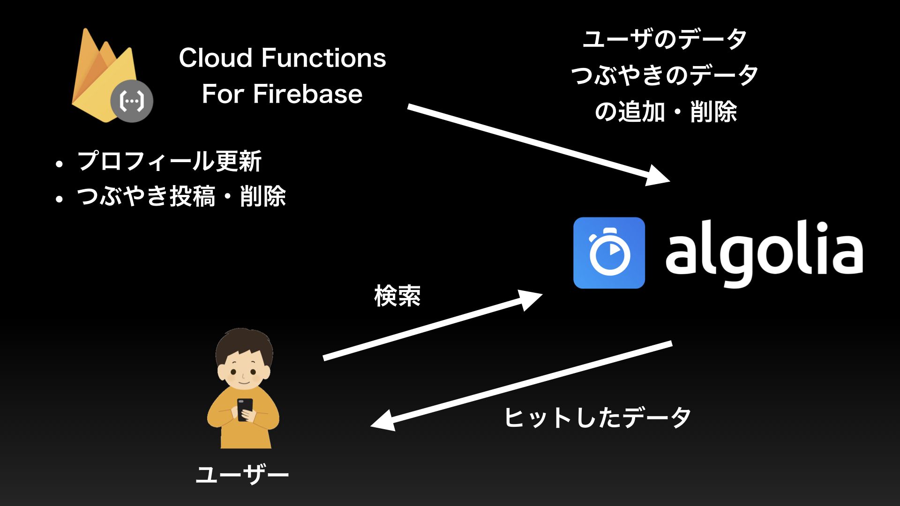

# 概要

---

　当チームは、他学科の生徒と関わる機会が少ないことに目をつけた。  
他学科の生徒と交流を深める機会として主なものはテスト終了後のイベント大会だが、イベント大会が学科内で行われる場合があることや、3学期制から前後期制への変更に伴うテスト・イベント大会の回数減少などを考慮すると、やはり他学科の生徒と交流を深める機会は少ない。  
近年ではコミュニケーションを図る方法の1つとしてTwitterやInstagramなどのSNSがあるが、それらはユーザー数が多すぎるため、当校の生徒のみを抽出して交友関係を築くのは非常に困難である。  
そこで、当校の生徒のみが使えるローカルなSNSを作成することにより、他学科、他学年の生徒と交流を深めようと考えた。  
そして、取り組むにあたって「動くものを公開する」「本サービスで他学科の生徒と交流を深める」という2つの目標を立てた。  
　しかし、実際に公開した結果、登録して利用していたユーザーは25人程度と非常に少なく、その半数以上がITスペシャリスト科の生徒であった。  
「動くものを公開する」という目標は達成することができたが、「本サービスで他学科の生徒と交流を深める」という目標は達成することができなかった。  
各学科の生徒へ行ったアンケートと、アクセス解析で得られたデータを参照すると、ITスペシャリスト科以外の利用者が少ない原因は「宣伝不足」と「アカウント作成が難しい」の2つであると結論付けた。  

# 目次

---

* 1.はじめに

    + 1-1.作品制作の背景
    + 1-2.目的・目標
    
* 2.作品について

    + 2-1.企画書・概要設計書・プロトタイプ
    + 2-2.変更点
    + 2-3.機能一覧・ロゴ
    + 2-4.言語・フレームワーク
    + 2-5.使用したツール・サービス
    + 2-6.リポジトリ
    
* 3.準備

    + 3-1.スケジュール
    + 3-2.宣伝方法

* 4.結果と考察

    + 4-1.アクティブ数
    + 4-2.アンケート
    + 4-3.考察
    
* 5.結論

* 6.開発について

    + 6-1.苦労した点・工夫した点
    
        + 6-1-1.全文検索機能の実装
        + 6-1-2.iPhoneの画像回転問題
        + 6-1-3.プロジェクトマネジメント
        
    + 6-2.感想

* 謝辞

# 1.はじめに

---

## 1-1.作品制作の背景

　当チームは、他学科の生徒と関わる機会が少ないことに目をつけた。     
他学科の生徒と交流を深める機会として主なものはテスト終了後のイベント大会だが、イベント大会が学科内で行われる場合があることや、3学期制から前後期制への変更に伴うテスト・イベント大会の回数減少などを考慮すると、やはり他学科の生徒と交流を深める機会は少ない。  
近年ではコミュニケーションを図る方法の1つとしてTwitterやInstagramなどのSNSがあるが、それらはユーザー数が多すぎるため、当校の生徒のみを抽出して交友関係を築くのは非常に困難である。  
そこで、当校の生徒のみが使えるローカルなSNSを作成することにより、他学科、他学年の生徒と交流を深めようと考えた。  

## 1-2.目標

* 動くものを学園祭までに公開すること
* 本サービスで他学科の生徒と交流を深める

以上の2つを目標として卒業制作に取り組むことにした。 

上記の「動くもの」とは以下の機能を備えたものとする。

* 情報を発信する機能
* 発信された情報を見る機能
* 発信したユーザーのプロフィールを見る機能
* 自分のプロフィールを設定する機能 

# 2.作品について

---

## 2-1.設計書・プロトタイプ等    

| URL | 備考 |
|-|-|
|[設計書(初版)](https://drive.google.com/open?id=1PBPC-ryoIpd0vv1dmeGV4g9G8Skd2V-4ZmR3kmuv1aQ)|Googleドライブ|
|[プレゼン資料](https://drive.google.com/open?id=1x-ebxXXLJ2KlmSz3z30IUccbRDWbMduf)|Googleドライブ 一部デザインが崩れている|
|[設計書（第2版）](https://drive.google.com/open?id=1Gr8TlcWyGEIbH7owugbkJvEV1jPTQhBuHDNjHFOlweI)|Googleドライブ|
|[プロトタイプ](https://prottapp.com/p/de367f#/s/5b4c574a4942fb6afad28d54)|スマホからの閲覧はアプリが必要 |   
   

## 2-2.大幅な変更点

### 仮登録廃止

学籍番号と任意のパスワードで「仮登録」を行い、こちらから本人確認を行うことで利用できるようにするという形だったが、ユーザーが多いと手間がかかるうえ、非現実的であったため廃止。   
Office 365を利用して登録・本人確認を行うように変更。

### レスポンシブデザイン廃止(Bootstrap廃止)

PCからのログインは少ないと考え、PC版のデザインは重要ではないと判断。   
ハイブリッドアプリへ切り替えたため、BootstrapからonsenUIへ変更。

### 自前サーバからFirebaseへ

サーバーを用意し、バックエンドをPythonで書くことになっていたが、スケジュール・学習状況やパフォーマンスなど様々な面を考慮し、断念。   
Firebaseへ切り替えた。

### 「友達」「グループ」廃止

「友達」と「グループ」の2つは目標達成に必要ではないと判断し廃止。  
機能は「タイムライン（つぶやき）」「プロフィール」「検索」の3つに。


## 2-3.機能一覧・ロゴ

### 機能一覧

| 機能 | 説明 |
|-----|------|
| タイムライン | 全てのつぶやきが表示されている |
| つぶやき | 文字・画像を使用してつぶやく・削除可能 |
| コメント | つぶやきに対してコメントを残す・削除可能 |
| 検索 | ユーザー・つぶやきの全文検索 |
| プロフィール | プロフィール画像・名前・性別・学科・自己紹介文・サークル<br>学科は自動で設定、性別は初回プロフィール入力時に設定|

### ロゴ


テーマ：人と人との繋がり, よりシンプルに   
作成者：グラフィック科2年 上原優人   

## 2-4.言語・フレームワーク

言語： HTML5, CSS3, JavaScript   
フレームワーク： Vue.js, onsenUI   
ライブラリ： Jimp

## 2-5.使用したツール・サービス

| サービス・ツール名 | 使用例 |
|-----------------|--------------|
| Firebase | データベース・ホスティング・アナリティクス・会員登録などの機能 |
| Cloud Functions | 全文検索の実装 6-1-1で説明 |
| Algolia | 全文検索の実装 6-1-1で説明 |
| GitLab | バージョン管理・GitLab CIによるデプロイ自動化・Issue boardでのタスク管理 |
| Prott | プロトタイプ作成・イメージの共有 |
| Slack | コミュニケーションツール・GitLabとの連携 |
| ESLint | JavaScriptの構文エラーチェック |


## 2-6.リポジトリ

[きゃりったー](https://gitlab.com/career_nexus/sns)


# 3.準備

---

## 3-1.スケジュール

サービス公開までのスケジュール(2018年から)

|  | 開始 | 終了 |
|---|-----|-----|
| プログラム作成 | 2018/02/01 | 2018/05/01 |
| 概要設計(やり直し) | 2018/05/02 | 2018/05/31 |
| プログラム作成 | 2018/06/01 | 2018/11/01 |
| テスト | 2018/11/02 | 2018/11/19 |
| 準備 | 2018/11/19 | 2018/11/20 |
| 公開 | 2018/11/21 | ~ |

## 3-2.宣伝方法

* Microsoft Teams 「学生一般チャネル」にてQRコード・URL・マニュアル付きで宣伝
* 他学科の友人への宣伝
* SNSを使った宣伝

# 4.結果と考察

---

## 4-1.利用率

[利用率のデータ](https://drive.google.com/open?id=1N9yG24hDFYONwUGhpEZLTpQvN1i5I7MD)

全ユーザー

| 学科 | 利用者数 |
|--------------|---:|
|ITスペシャリスト| 27 |
|TV映像音響 | 3|
|こども | 3|
|グラフィック| 5 |
|ビューティ | 3 |
|医療系 | 8 |

アクティブユーザーのみ

| 学科 | 利用者数 |
|--------------|---:|
|ITスペシャリスト| 16 |
|TV映像音響 | 1 |
|こども | 0 |
|グラフィック| 4 |
|ビューティ | 0 |
|医療系 | 4 |

## 4-2.アンケート

各学科ランダムで10名、合計60名にアンケートを取った。   
以下のような結果になった。

[アンケート結果](https://drive.google.com/open?id=1ZeOyvPoxOOLpAU5mI2UgXOWhXQrWfSNq)

| 携帯にTeamsが入っていますか | 全体 | ビューティ | こども | グラフィック | 医療系 | TV映像音響 | ITスペシャリスト |
|------------------------|-----|-----------|-------|-------------|------|-----------|-----------------|
|入っている| 50 | 10 | 7 | 8 | 8 | 8 | 9 |
|入っていない | 10 | 0 | 3 | 2 | 2 | 2 | 1 |

| Teamsが入っていない理由 | 全体 | ビューティ | こども | グラフィック | 医療系 | TV映像音響 | ITスペシャリスト |
|------------------------|-----|-----------|-------|-------------|------|-----------|-----------------|
| インストールが面倒 | 1 | 0 | 0 | 1 | 0 | 0 | 0 |
| パスワードを覚えていない・分からない | 6 | 0 | 2 | 0 | 2 | 2 | 0 |
| 導入方法が分からない | 1 | 0 | 1 | 0 | 0 | 0 | 0 |
| 動作が遅くなるため、あえて入れていない | 1 | 0 | 0 | 1 | 0 | 0 | 0 |
| その他 | 1 | 0 | 0 | 0 | 0 | 0 | 1 |

| 週に何回Teamsを開きますか | 全体 | ビューティ | こども | グラフィック | 医療系 | TV映像音響 | ITスペシャリスト |
|------------------------|-----|-----------|-------|-------------|------|-----------|-----------------|
|ほぼ毎日     | 3 | 0 | 0 | 0 | 0 | 0 | 3 |
|週1~3       | 12 | 6 | 0 | 1 | 0 | 1 | 4 |
|週3~5       | 4 | 1 | 1 | 0 | 0 | 0 | 2 |
|ほぼ開かない | 31 | 3 | 6 | 7 | 8 | 7 | 0 |

| パスワードを覚えていますか | 全体 | ビューティ | こども | グラフィック | 医療系 | TV映像音響 | ITスペシャリスト |
|------------------------|-----|-----------|-------|-------------|------|-----------|-----------------|
|覚えている     | 19 | 5 | 2 | 3 | 0 | 4 | 5 |
|覚えていない   | 22 | 3 | 1 | 4 | 7 | 4 | 3 |
|分からない     | 9 | 2 | 4 | 1 | 1 | 0 | 1 |

| 「きゃりったー」ご存知ですか | 全体 | ビューティ | こども | グラフィック | 医療系 | TV映像音響 | ITスペシャリスト |
|------------------------|-----|-----------|-------|-------------|------|-----------|-----------------|
|知っている     | 15 | 1 | 0 | 3 | 0 | 3 | 8 |
|知らない       | 20 | 7 | 6 | 3 | 2 | 2 | 0 |
|聞いたことある  | 15 | 2 | 1 | 2 | 6 | 3 | 1 |

## 4-3.考察

4-1.利用率 で分かる通りユーザー数が非常に少なく、他学科の生徒の利用率などを見ると「他学科の生徒と交流を深める」という目標は達成することができなかったと言える。   
ではなぜ全体的に利用率が低く、他学科の利用者が少なかったのか、というところを考察していく。   

利用率やアンケート結果から、ユーザーが少ない原因は「宣伝不足」「登録が困難」の2つあるという仮説を立てた。   

### 宣伝不足

まずは「きゃりったー」の知名度がどのくらいか、各学科の生徒へ行なったアンケートを参照して見ていく。   
ITスペシャリスト科の生徒は、概要設計発表や中間発表などで「きゃりったー」の存在を知っていたので、ITスペシャリスト科のデータは除いたグラフになっている。


   
Teamsの学生一般チャネル（全校生徒・教員へ通知されるチャネル）で宣伝したにも関わらず、約50%の生徒が「知らない」と回答した。   

これはMicrosoft Teamsの使用率が影響していた。  


   
アンケートを取った生徒（IT除く）の74%が「ほとんどTeamsを開かない」と回答した。  
つまりTeamsはそれほど浸透しておらず、Teamsを使用した宣伝は効果的ではなかったということが分かった。   

以上のデータから、ユーザーが少ない理由の1つは「知名度不足・宣伝不足」であると考えられる。   

### 登録が困難

きゃりったーに登録するには、Office 365へのログインが必要になる。   
しかし、アンケート結果を参照すると、Office 365のパスワードを覚えていない生徒が多いことが分かった。   



67%の生徒が覚えていない・分からないと回答した。     
「きゃりったーを知っている・聞いたことがある」という状況でも、パスワードを覚えていないが故に利用することができなかったというユーザーを増やしてしまった、という結果になった。   

実際に「きゃりったーを知っている・聞いたことがある」と答えた生徒で、パスワードを覚えていない・分からないと答えた生徒は半数以上いた。   



つまり、登録に必要な条件を満たしている生徒が少なかったため、結果としてユーザーを獲得することができなかったと考えられる。   
仮に宣伝がうまくいきサービスの知名度が上がったとしても、登録でつまずいてしまうため、結果は変わらなかったであろうと予想される。   

# 5.結論

Microsoft Teamsを使って宣伝を行なったが、一部の生徒にアンケートを取った結果、50%の生徒は「きゃりったー」を
Teamsを開かない生徒が多かった  

# 6.開発について

## 6-1.苦労した点・工夫した点

### 6-1-1.全文検索機能の実装

全文検索を実装する予定だったが、完全一致でしか検索を行うことができなかった。   

### 原因

Firestore(Firebaseのデータベース)では全文検索の機能をサポートしていなかった。   

### 対策

AlgoliaとCloud Functionsを使用して全文検索を実装した。（Algoliaのライブラリも使用）   
Algoliaとは、全文検索を可能にしてくれるサービスで、Cloud Functions for Firebaseはイベントをトリガーにして任意の処理を実行できるサービスである。   
Cloud functionsで、検索に必要なデータをAlgoliaへ送信する。
つまりFirestoreとAlgoliaのデータを同期させ、検索はAlgoliaで全て行うようにした。

Cloud Functionsで、以下のトリガーと処理を設定した関数を登録する。   

| トリガー | 処理内容 |
|---------|---------|
| つぶやきが投稿された時 | 投稿されたつぶやきのデータをAlgoliaへ送信する |
| つぶやきが削除された時 | 削除されたつぶやきのIDと一致するAlgoliaのデータを削除する |
| プロフィールが更新された時 | 更新後のプロフィールのデータをAlgoliaへ送信する |

 
以下のコードは実際にfunctionsに登録した関数である。 

```
exports.PostMutter = functions.firestore
    .document('timeline/{docId}')
    .onCreate((mutter) => {
        const data = mutter.data();

        const algoliaObject = {
            objectID: mutter.id,
            data,
        };
        
        const index = client.initIndex(ALGOLIA_MUTTER_INFO);
        return index.saveObject(algoliaObject);
    });
```

この関数では、つぶやきのドキュメントが作成された時、作成されたドキュメントのデータをオブジェクトに入れ、そのオブジェクトをAlgoliaへ送信するという処理を行なっている。

以下の画像が検索のデータの流れを表したものである。   



### 6-1-2.iPhoneの画像回転問題

iPhoneで撮影した写真をiOS以外のプラットフォームで閲覧すると回転してしまう問題が浮上した。   

### 原因

iPhoneで撮影した写真は内部的には傾いた状態で、Exifのorientation情報で傾きを修正していることが分かった。  
orientation情報を読み込むか読み込まないかで画像の向きが変わってしまう。    

### 対策

ライブラリの「Jimp」を使用して、FileAPIで画像を読み込んだ際に傾きを修正・画像の圧縮等を行う。   

以下のコードが実際に使用したJimpのコードである。

```
ImagePress(img) {
 this.dialogVisible = true;
 Jimp.read(img, (error, lenna) => {
    lenna.resize(600, Jimp.AUTO)
      .quality(70).getBase64(Jimp.MIME_JPEG, (err, image) => {
        this.img = image;
        this.dialogVisible = false;
    });
 });
}
```

これにより、orientation情報で傾きを修正するのではなく、画像そのものが傾きがない状態になるので、iOS以外のプラットフォームで画像が回転する現象はなくなった。      

余談だが、Jimpを使用する前は画像サイズが非常に大きく、読み込みに時間がかかってしまっていたので、Jimpで圧縮も行うことができたのは非常に助かった。

### 6-1-3.プロジェクトマネジメント

当チームは、プロジェクトマネジメントがうまくいかなかった。   
先生や特別講師の方とお話をして「こうするべきだった・これはするべきではなかった」と思ったところや、個人的な意見を書き記そうと思う。（その方法が正しいかどうかは別として）   

### 作品のイメージは必ず共有する
   
自分たちが作る作品はどのようなものなのか、というイメージを共有しておかなければ後々方向性に違いが出てくる可能性がある。   
プロトタイプを作成し、共有することで方向性の相違を防ぐことができる。   
当チームは画面設計書が非常に曖昧で、細かなデザインについて何度も話し合いがあったが、途中からはProttでイメージを共有したため比較的スムーズに作業することができた。

### タスクは細分化しより明確に

タスクの内容が漠然としていると何から手をつけるべきか困惑してしまう。   
例えば、「つぶやきの機能を作る」という漠然としたタスクでは、何を使ってどのように実装するか、というところが分からない。   
具体的につぶやきの機能を作るためには、まずfirestoreでtimelineというコレクションを作成し、ドキュメントのフィールドは投稿者のUID・つぶやき内容・画像URL・タイムスタンプの4つで...という風に複数の手順がある。   
その作業の1つ1つをタスクにするのである。   
そうするとタスクをこなすうちに全体像が見えてくるので、自分の頭で考えて取り組むことができる。   
それだけではなく、目的が明確なため検索も非常にやりやすい。つぶやきの例だと「firestoreの始め方」「コレクション作成方法」など、検索に必要なワードの抽出に苦労することがなくなる。      

### 進捗報告は正確に

当チームで進捗確認を行なった際、曖昧にされることが多々あった。   
後から分かったが、全く進んでおらず報告しづらかったということだった。   
進捗管理をする側としては、どのくらい進んでいて、終わっていない場合はどのような課題が残っているのか、など具体的な情報を欲している。   
その情報を元にスケジュールを考えるのだが、そこで曖昧にされたり嘘をつかれたりして、実際の作業量と想定している作業量の差が大きくなることが一番面倒である。   
つまり進捗管理をする側は、報告がしやすい環境づくりを行い、報告をする側は正確な情報を渡す努力が必要である。      

### 質問の仕方・タイミングを考える

作業中に分からないところが出てきた場合、リーダーや先生に質問をすることになると思うが、その際に気をつけてほしい点がいくつかある。   
まず1つは質問の仕方。   
質問する前にまず自分で情報を整理すること。何がしたかったのか、何を聞きたいのか、どういう状況なのか等。   
そして質問する際は整理した情報を正確に伝えて、腹に落ちる回答をもらうまでは引き下がらないようにする。分かったふりは絶対してはいけない。   
もう1つは質問のタイミング。   
質問する前に自分で考えることも必要だが、その時間が長過ぎると全体的に遅れが生じる。   
なので、例えば15分考えて分からない場合は質問する、などおおまかな目安を決めることも非常に重要である。   
質問することは悪いことではなく、むしろするべきだが、質問の仕方はきちんと考えるべきだと感じた。


## 6-2.感想

### 折田

### 松原

### 高倉

### 池本

## 謝辞

今回のプロジェクトで、様々な人にお世話になりました。   
先生や特別講師の方々をはじめ、テストに参加してくださった方々、公開の際に登録・閲覧・利用してくださったユーザーのみなさま、そしてプロジェクトメンバー。   
非常に有意義な卒業制作に取り組むことができ、最優秀賞という名誉ある賞を頂けたのは、当チームのメンバーの頑張りだけではなく、皆さまの協力があったからこそだと思っています。   
本当にありがとうございました。
